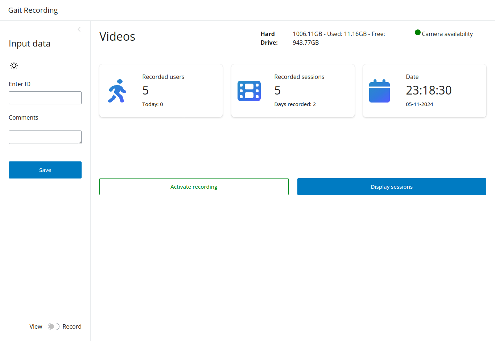

Here all important information are stored to start recording with the Gait recording system.

## User Interface

#### [Header Information](instructions/header.md)

The header information is displayed on top of the screen and shows the current status of the system.

#### [Information Cards](instructions/info_cards.md)

This section explains what can be seen on the information cards.

## [Main Functionalities](instructions/main_functionalities)

The main functionalities describe how to start recordings and manage recorded sessions.

#### [Viewing Sessions](instructions/main_functionalities/view_session.md)

This chapter describes how to view recorded sessions and access the recordings.

#### [Convert Sessions](instructions/main_functionalities/convert_session.md)

This chapter describes how to convert recorded sessions to view single Gait cycles.

#### [Edit Sessions](instructions/main_functionalities/edit_session.md)

This chapter describes how to edit metadata of recorded sessions.