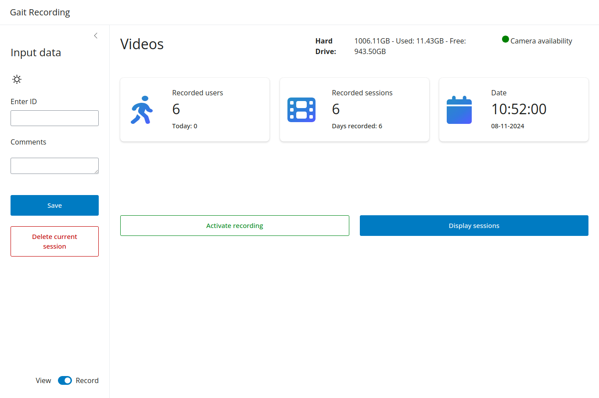
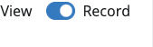
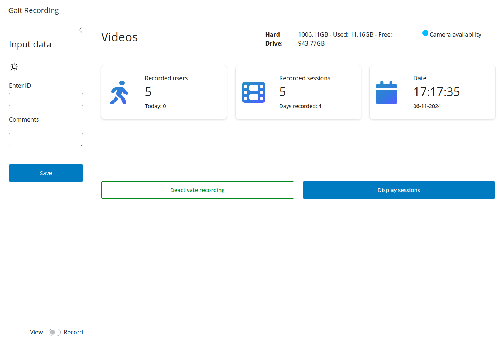
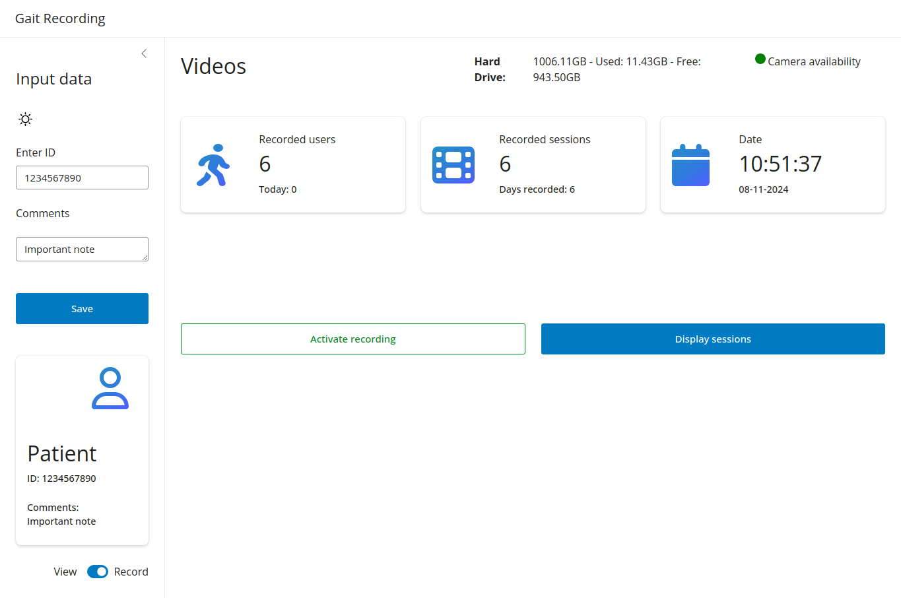

## Preconditions
1. Make sure you have placed the camera in a suitable location and connected it to the power supply.
2. Connect the camera to the system running the Gait Cycle Recorder, i.e.: Raspberry Pi
3. Start the GaitAnalysis application from the desktop.

## Steps
### Start recording
??? Info "In case recording doesn't start"
    In case of unsaved recordings, the application will prompt you to save them before starting a new recording.
    

1. Make sure the switch at the bottom left is set to **Record** 
   { align=right }
2. Next you can start recording, by clicking "Activate Recording" button. This will start the recording process and change the button text to "Deactivate Recording". 

    - The video is being recorded in the background. The status led for camera availability will turn blue while the camera is recording.
    - While the camera is recording, timestamps are stored for each start and end if the light barrier is crossed. These timestamps are then used to extract the corresponding gait cycles from the video, as soon as conversion is triggered.
   
3. As soon as the participant has completed the required runs, click "Deactivate Recording" to stop the recording process.
    - The status led for camera availability will turn back green in case no issues arise.
4. After completing the recording the interface will look like this:

5. Before starting a new recording you will need to save the recording with a unique ID. Comments are optional. Otherwise, recordings can't be saved.

### Save recording
After completing the recordings the data and metadata needs to be stored safely by assigning an ID to it. This ID will be used to identify the recording in the future. Comments are optional.

After saving the recordings, they can be managed with the operations under "Display sessions".