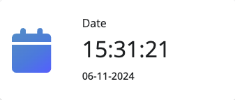

The information cards display some interesting side information to the user.

- Recorded users { align=right }
    - The total amount of recorded users so far and that are saved on the Raspberry Pi.
    - Today: Shows the total amount of users that has been recorded on the current day
- Recorded sessions { align=right }
    - The currently recorded sessions so far
    - Days recorded: Shows the amount of days that have been recorded with at least one session
- Date and time { align=right }
    - The current date and time of the system