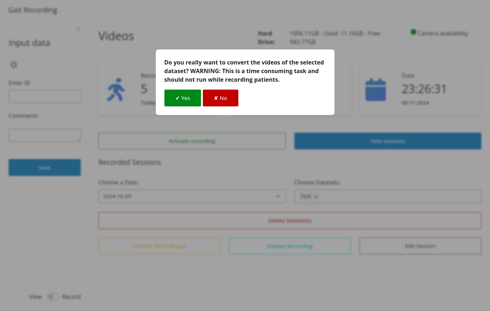
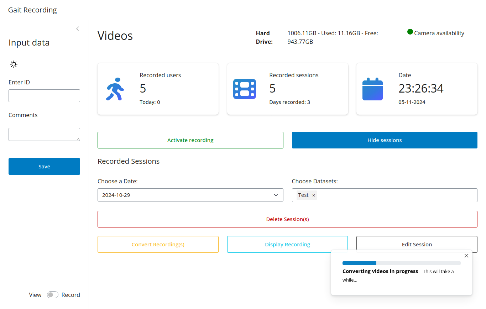

To split the recorded videos in multiple gait cycles, the user needs to convert the recordings.
After conversion is completed the user can view the recordings with the Display recordings functionality.

#### Initiate conversion process

??? Warning "Warning: Conversion Process"
The conversion process can take a while depending on the size of the recordings. If possible the conversion shouldn't
take place while making recordings, since it can slow down the recording process and decrease the quality of the
recordings.

#### View of the conversion Progress

