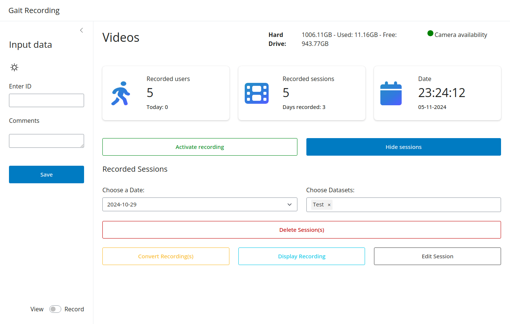

In case the metadata of a dataset needs to be changed, the user can edit the metadata of the dataset. By clicking on "
Edit Session", the stored metadata is opened in the side panel and can be edited and resaved to the dataset.

#### View before editing metadata

#### View while editing metadata

After activating the Edit Session button the existing metadata will be displayed in the side panel. The user can now
edit the metadata and save the changes by clicking on the "Save changes" button. In case the user decides to keep the
metadata as they are, the user can click on the "Cancel" button to close the side panel without saving the changes.

