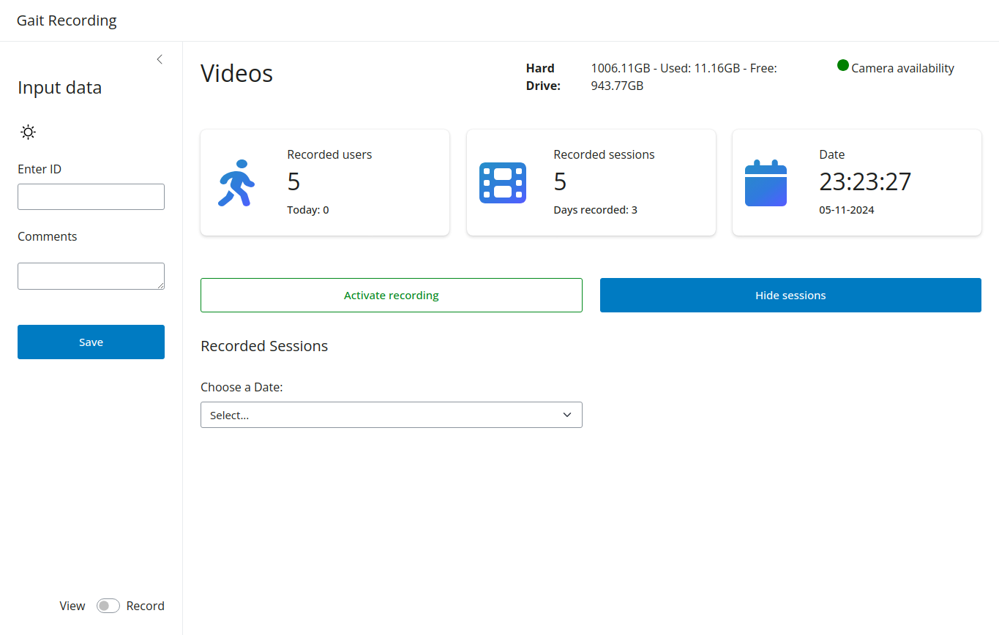
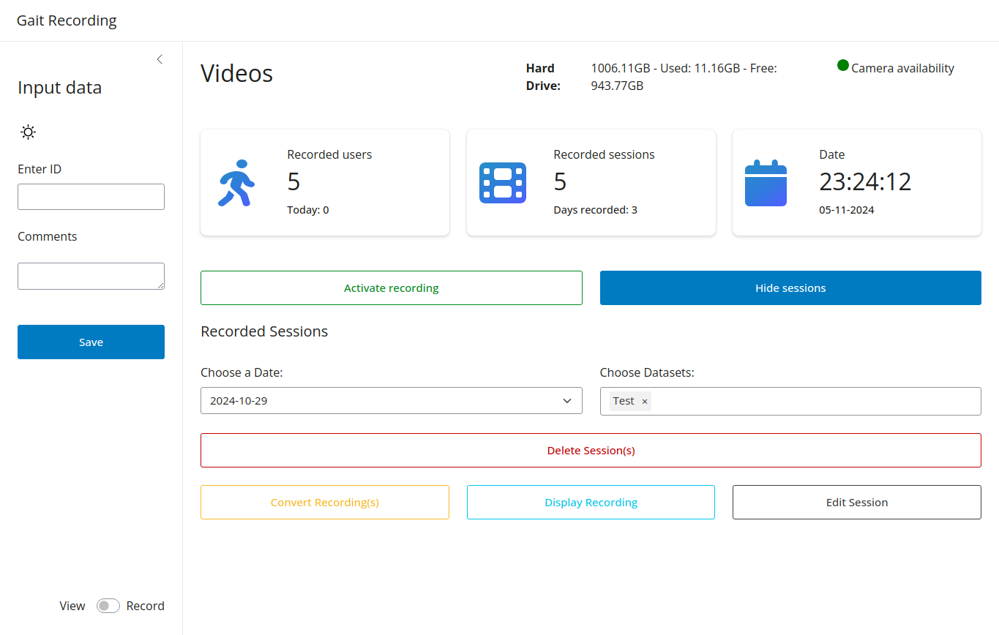
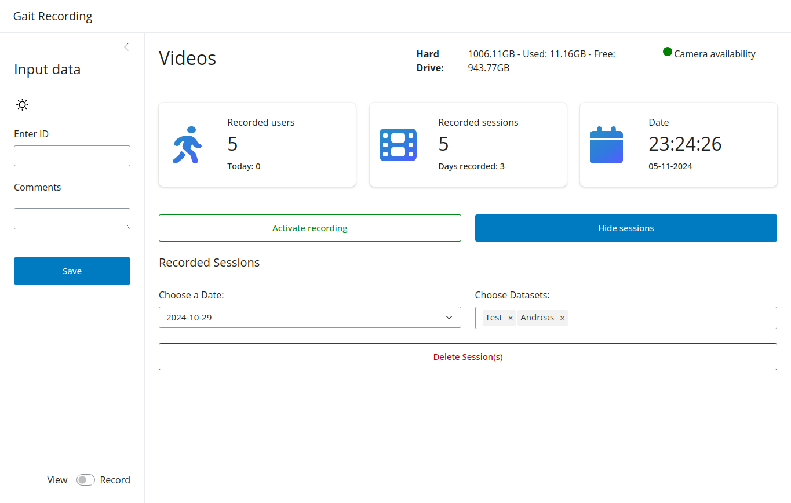

To manage the recordings, the user can select the data and the dataset(s) of the specific recordings. The dataset
selector allows the user to choose the dataset to be analyzed.

## Date Selector

The date selector lets the user narrow down the datasets based on a specific day.

## Dataset Selector

The dataset selector is a multi selector, which means that multiple datasets can be selected at the same time.

!!! Info
If selecting multiple datasets, the user can only delete them. The other options are hidden. Selecting a single dataset
will give the user more options to adapt the dataset.

#### Single Dataset

#### Multiple Datasets

