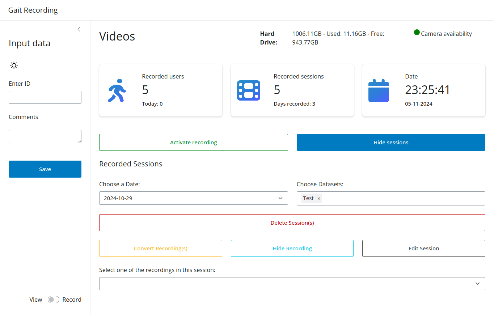
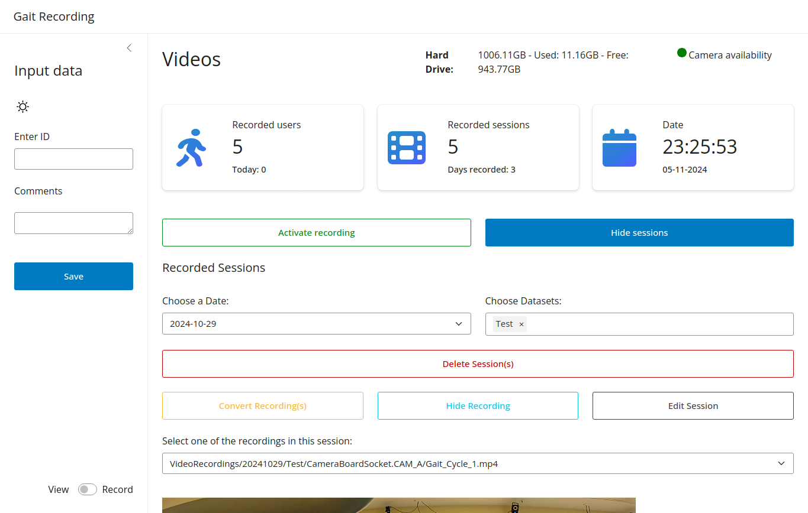

To review the gait cycles the user can do that by selecting "Display Recording".

!!! Warning
The user can only view the recordings after the conversion process is completed. If the gait recordings are not split
into the respective gait cycles the user can't view the recordings.

#### Initiate display recordings

#### Select Gait Cycle

After deciding to stream the Gait Cycle the user needs to select which session needs to be displayed.

#### Stream Gait Cycle

??? Info
The playback speed can be adapted for the video.

