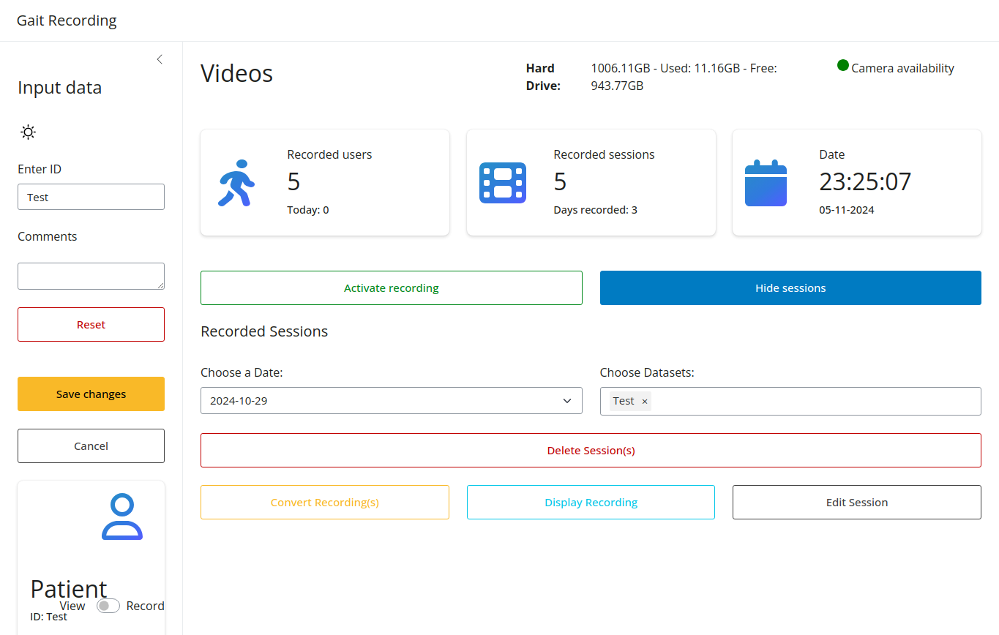

In case the metadata of a dataset needs to be changed, the user can edit the metadata of the dataset. By clicking on "Edit Session", the stored metadata is opened in the side panel and can be edited and resaved to the dataset.

#### View before editing metadata

#### View while editing metadata
