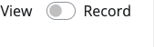
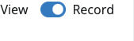
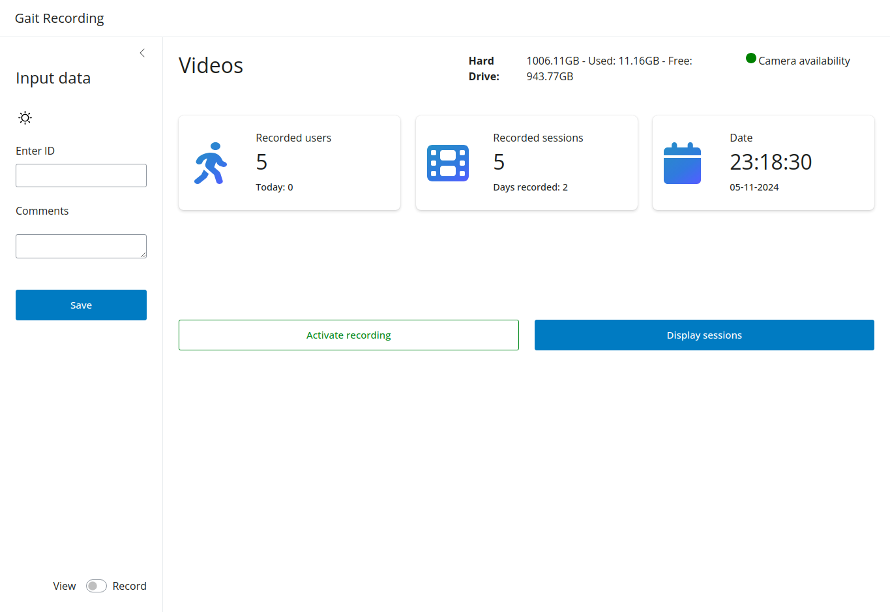

**(De-)Activate recording** and **Display/Hide Sessions** are the main functions of the main screen. The recording can be started and stopped by pressing the **Record** button. The **Session** button is used to display or hide the session list. The session list shows all recorded sessions. The session list can be used to select a session for further analysis.

## Recording
Clicking on the record button can start or stop the recording. Depending on the switch on the bottom left you can decide in which mode the camera should be used.

- **View**: { align=right }
If the switch is set to view, the camera will be used to display the video stream. The recording won't be saved.
---
- **Record**: { align=right }
If the switch is set to record, the camera will be used to record the video stream. The recording is saved when completed. 

## Session
The session button lets you show, hide, edit and view sessions that have been recorded. The session list can be used to select a session for further analysis.

!!! Warning
    Solely sessions which have been recorded and saved, are visible under the Sessions area.

